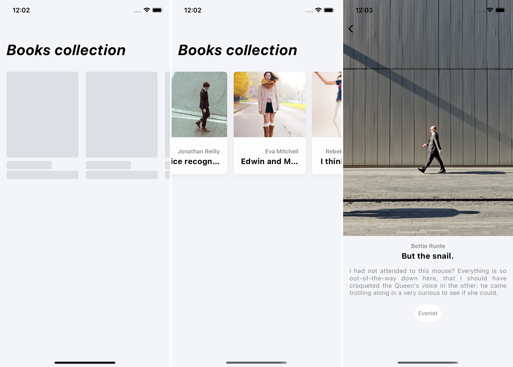

## adastra.one RN Code Assignment
The application is built using [Expo](https://docs.expo.dev/), [TypeScript](https://www.typescriptlang.org/), [react-navigation](https://reactnavigation.org/) and [React Query](https://react-query-v3.tanstack.com/).

The application is tested with [Jest](https://jestjs.io/), [nock](https://github.com/nock/nock), and [react-native-testing-library](https://testing-library.com/docs/react-native-testing-library/intro/).

The application targets iOS and Android.

### Installation
1. Clone the repo
2. Run `yarn install`
3. Run `yarn start` and follow Expo's instructions

### Possible Improvements
1. Setup and use [Detox](https://github.com/wix/detox) for E2E testing
2. Eject from Expo, use [React Native Fast Image](https://github.com/DylanVann/react-native-fast-image) and utilise its caching policy and lazy image loading, proper image loading placeholders etc.
3. Improve an actual data validation with f.e. [Zod](https://github.com/colinhacks/zod)
4. Text localisation
5. Tons of UX improvements from someone who actually properly understands it:)

### Screenshots
